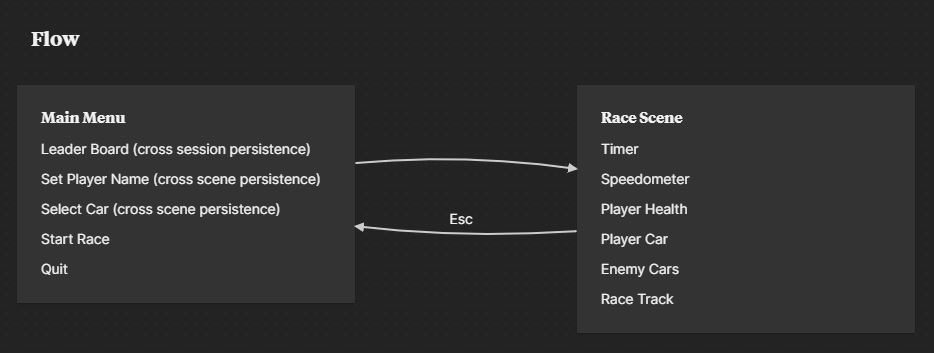
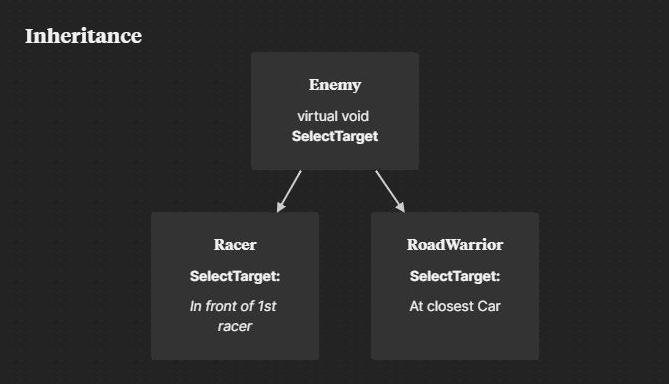

  

<h1 align="center">Programming-Theory</h1>

Submission 2 for Jr Programmer Pathway

## Project Design
  *I decided to use the design document I made earlier during learning. It's a destruction-derby-style car racing game.*

### Scene Flow

  

**Main Menu** scene consists of:
  - Leaderboard that displays 3~5 best times
  - Player name input field (with default value of "Player")
  - Car Selection
  - Start Race button
  - Quit button

**Race** scene consists of:
  - 3D model of players car
  - 3D models of enemy cars
  - Race Track
  - UI Timer
  - UI Speedometer
  - UI Player health

### Objects
Base class **Car** handles main functionalities of all cars that includes storing data such as:
  - speed
  - acceleration
  - health

  

Base class **Enemy** is responsible for enemy behaviour

  

